# Marktplatz

[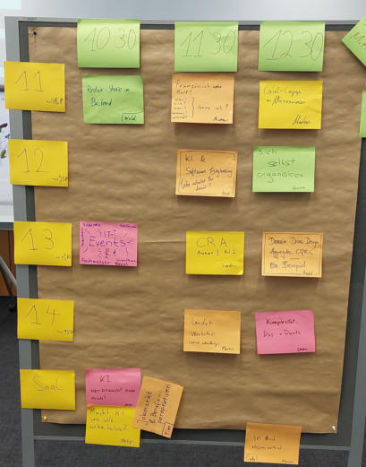](marktplatz/marktplatz-1_large.jpg)

[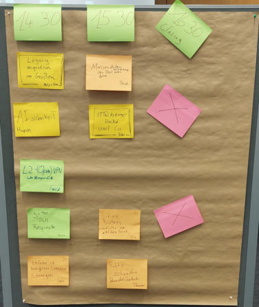](marktplatz/marktplatz-2_large.jpg)

# gute Pull Requests

[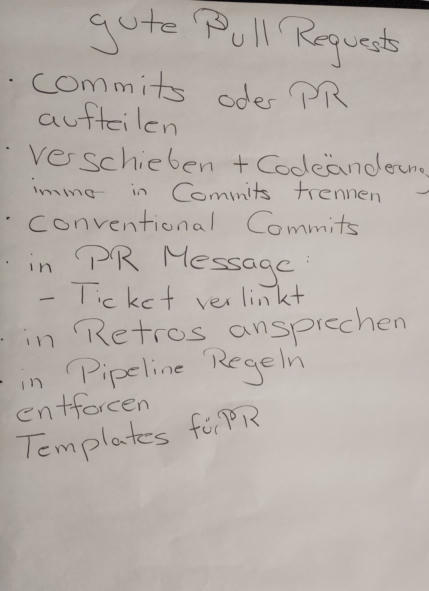](gute-pull-requests/gute-pull-requests_large.jpg)

# IT-Events

[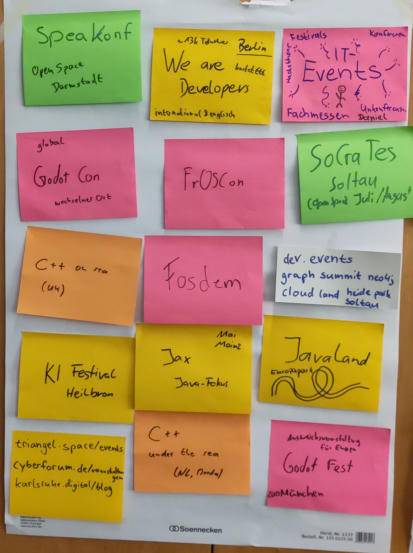](it-events/it-events-1_large.jpg)

[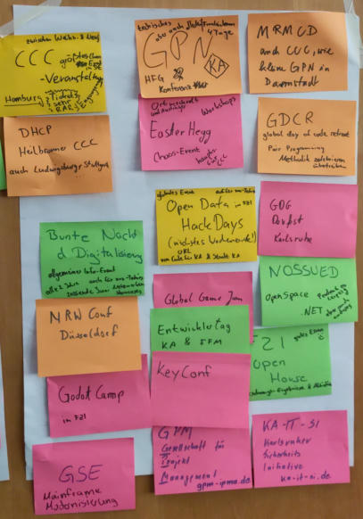](it-events/it-events-2_large.jpg)

# Redux-Store im Backend

# Cobol-Copies in Microservices

# CRA Annex I

# Godot-Workshop

# Komplexität -- Dos und Don'ts

# 3D-Druck Wissensaustausch

# Linux-Distros

[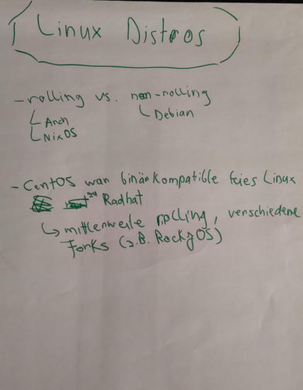](linux-distros/linux-distros-1_large.jpg)

[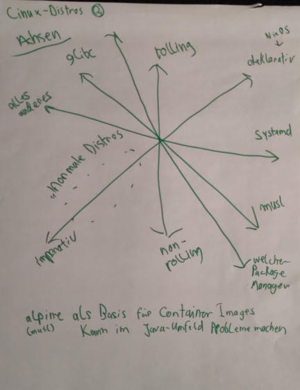](linux-distros/linux-distros-2_large.jpg)

[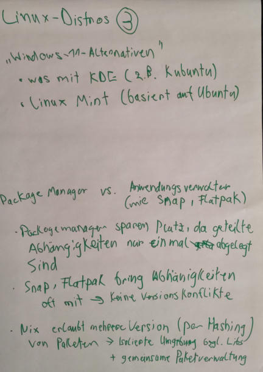](linux-distros/linux-distros-3_large.jpg)

# richtig schneiden

[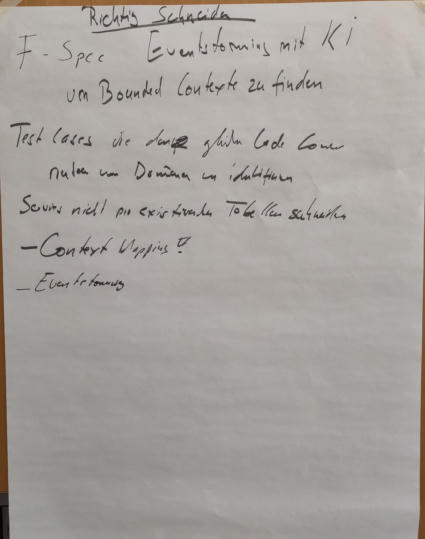](richtig-schneiden/richtig-schneiden_large.jpg)

# KI und Softwareentwicklung

[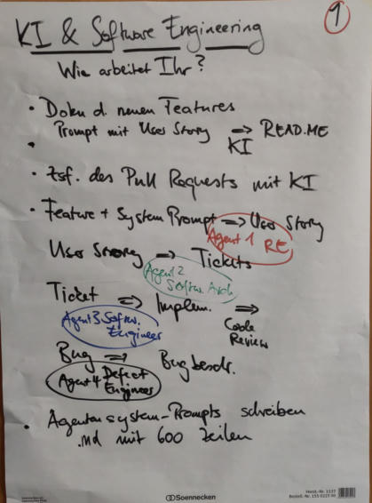](ki-und-softwareentwicklung/ki-und-softwareentwicklung-1_large.jpg)

[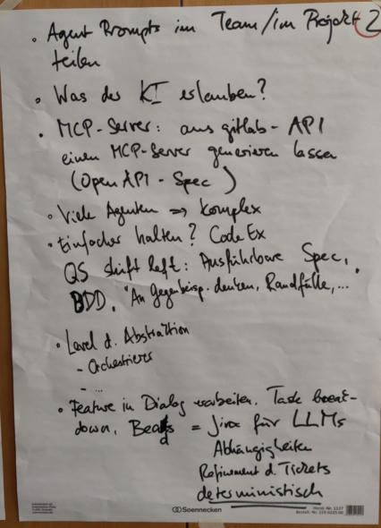](ki-und-softwareentwicklung/ki-und-softwareentwicklung-2_large.jpg)

[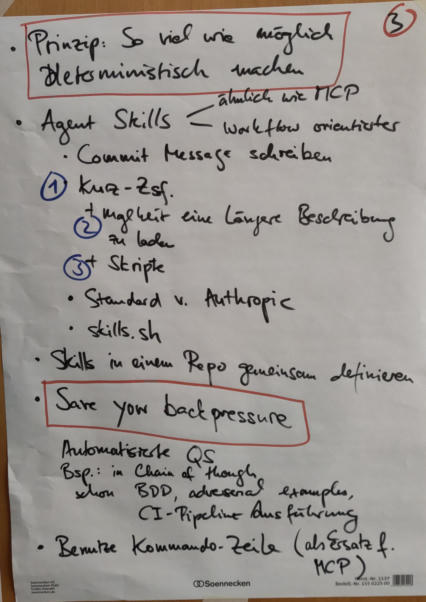](ki-und-softwareentwicklung/ki-und-softwareentwicklung-3_large.jpg)

[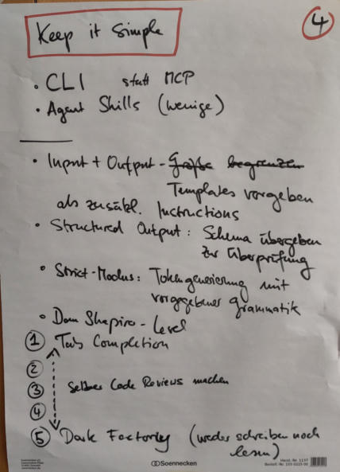](ki-und-softwareentwicklung/ki-und-softwareentwicklung-4_large.jpg)

[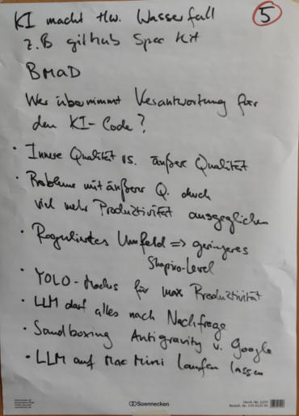](ki-und-softwareentwicklung/ki-und-softwareentwicklung-5_large.jpg)

# Lernen

[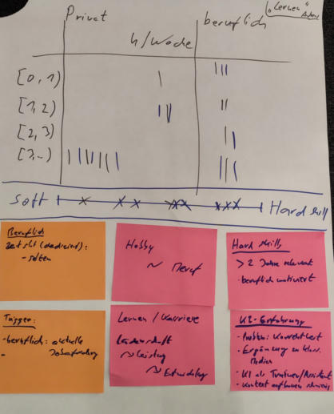](lernen/lernen_large.jpg)

# ki-driven-event-storming

[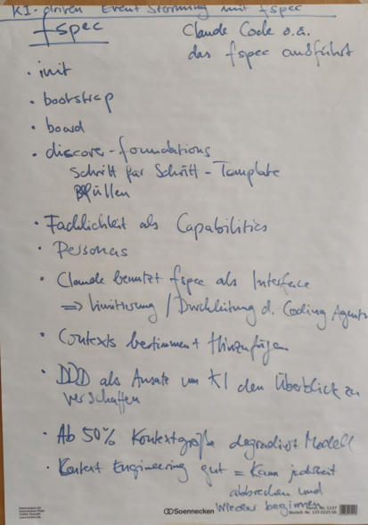](ki-driven-event-storming/ki-driven-event-storming_large.jpg)

# Legacy-Migration

[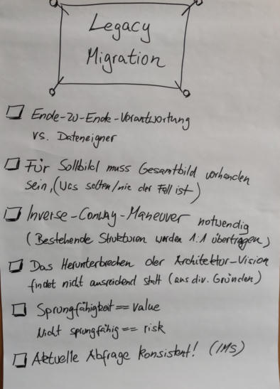](legacy-migration/legacy-migration_large.jpg)

# Einfach vs. komplex

[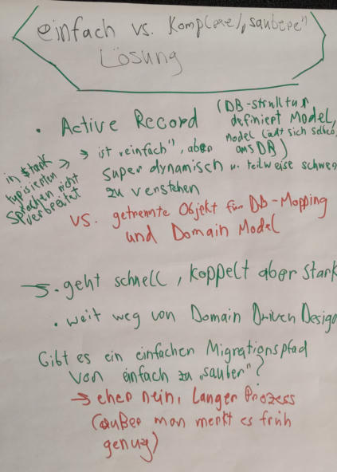](einfach-vs-komplex/einfach-vs-komplex-1_large.jpg)

[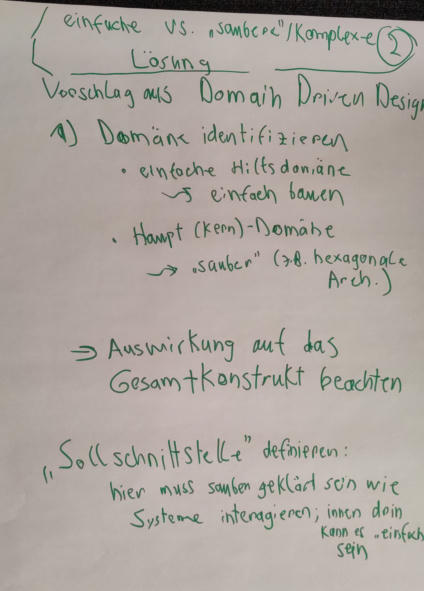](einfach-vs-komplex/einfach-vs-komplex-2_large.jpg)

# DDD-Konzepte

[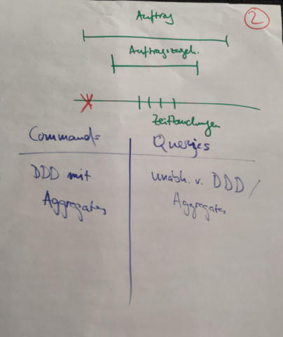](ddd-konzepte/ddd-konzepte-2_large.jpg)

[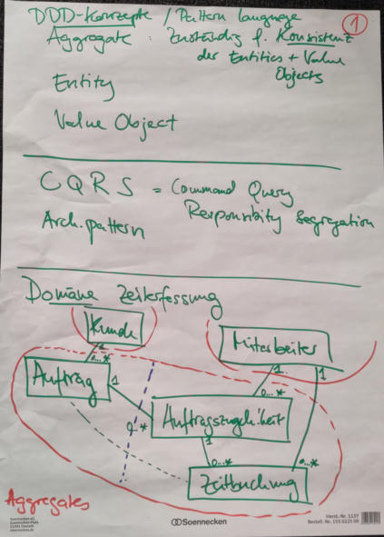](ddd-konzepte/ddd-konzepte-1_large.jpg)

# Getting things done (aka Sich selbst organisieren)

[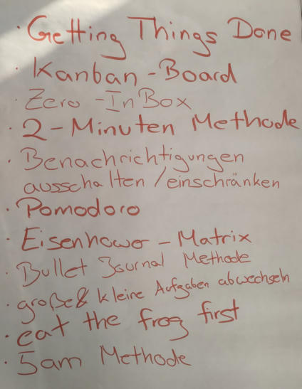](getting-things-done/getting-things-done-1_large.jpg)

[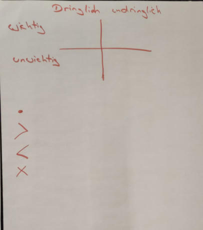](getting-things-done/getting-things-done-2_large.jpg)

# Docker und Co

[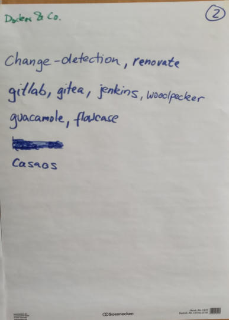](docker-und-co/docker-und-co-2_large.jpg)

[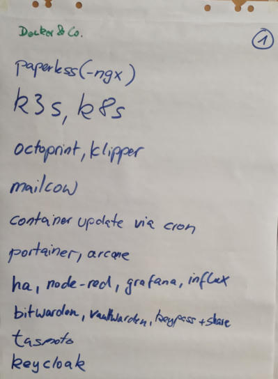](docker-und-co/docker-und-co-1_large.jpg)

# Massenverarbeitung per REST oder Batch

[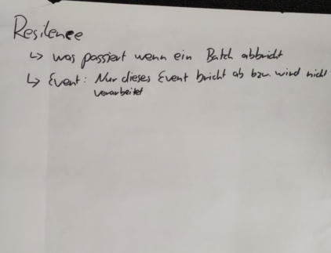](massenverarbeitung/massenverarbeitung-2_large.jpg)

[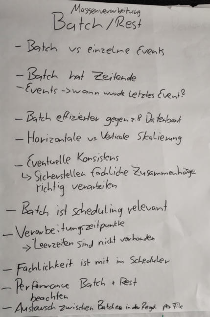](massenverarbeitung/massenverarbeitung-1_large.jpg)

# KI

[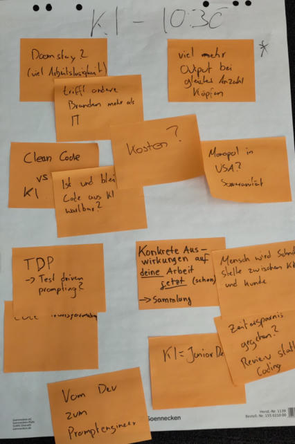](ki/ki_large.jpg)

# AI-Sicherheit

# L2-(Open) VPN (oder Wireguard)

# Feedback

[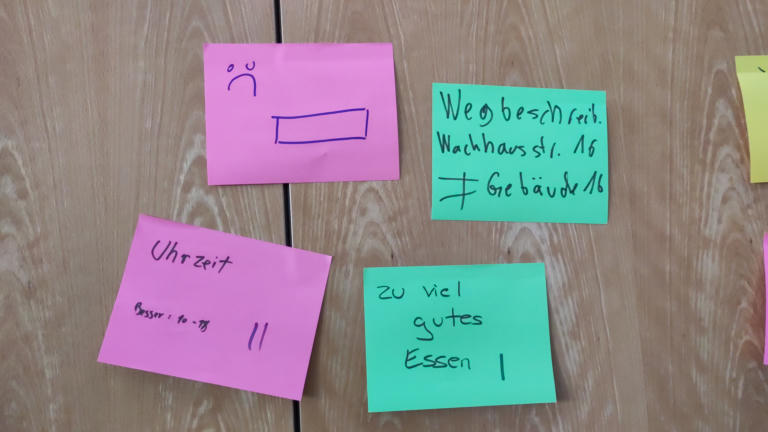](feedback/feedback-1_large.jpg)

[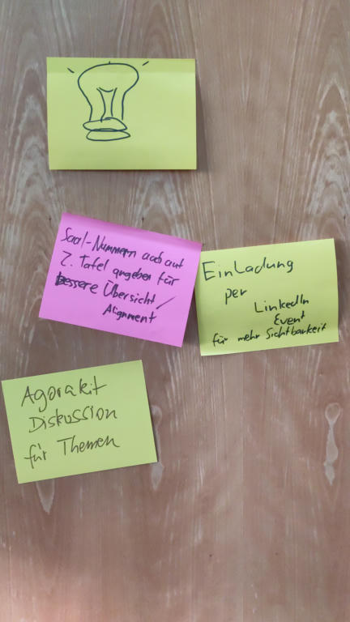](feedback/feedback-2_large.jpg)

[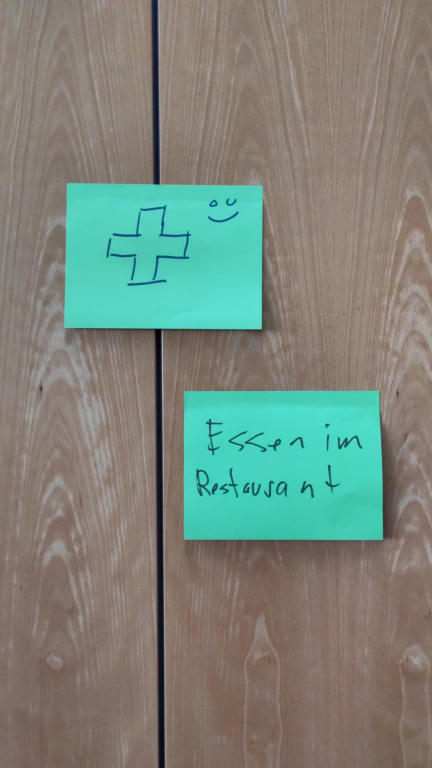](feedback/feedback-3_large.jpg)

[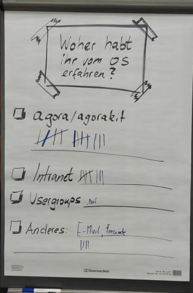](feedback/feedback-4_large.jpg)
